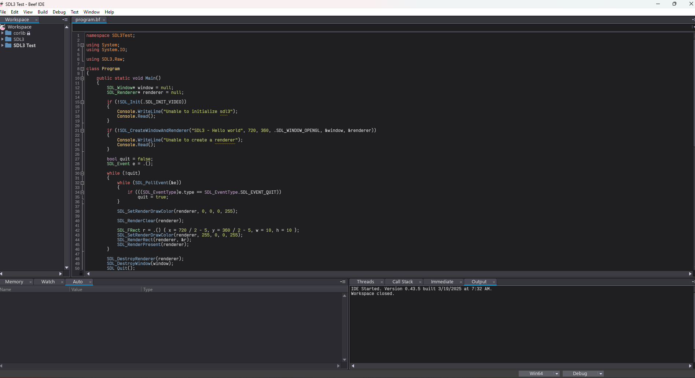

, 

## Instructions
1. Download this repo. (and star it ;) )
2. Extract "Mack16.toml" to "C:\Program Files\BeefLang\bin\themes" (Create a themes folder if you don't have one)
3. Go to "C:\Program Files\BeefLang\bin\images" and locate "DarkUI.png".
4. Double click "DarkUI.png" and rename it "DarkUI_Backup.png" or something similar
5. Go back to your zip file for this project and extract the "DarkUI.png" file to this. Replacing the file already there.
6. Start up the editor.

## Notes if you want to tweak UI elements (non syntax)
I haven't seen a whole lot of documenation on how to do this so I might as well help the next guy. BeefIDE is kinda wierd with how it's UI works. 

Every UI element in beef can be edited in the "DarkUI.psd" file under "C:\Program Files\BeefLang\bin\images". Open up that file in your favorite (hopefully non-adobe) product and you'll notice most every layer is tied to an icon on screen. If you want to change the code editor background edit this one image

,

Do your changes and export the image as "DarkUI.png" and bingo bongo your Beef IDE will be adjusted.

## How to tweak the syntax theme
Just open up Mack16.toml and tweak the values (they are in ARGB. So for 0xFF000000 FF represents the alpha). 
Background doesn't really do anything to my knowledge. You'll have to modify the "DarkUI.png" file described above.

